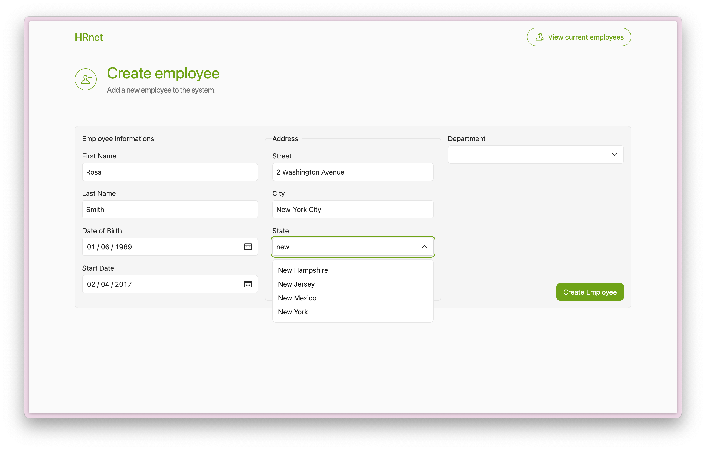
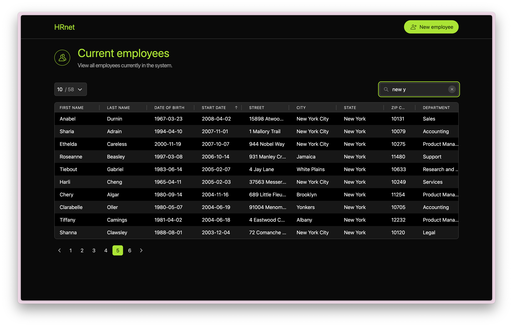

# HRnet - Employee Management System

[](https://reactjs.org/)
[](https://redux-toolkit.js.org/)
[](https://www.typescriptlang.org/)
[](https://tailwindcss.com/)
[](https://react-spectrum.adobe.com/react-aria/index.html)
[](https://www.npmjs.com/package/@spratch/whtable)

## Description

HRnet is an internal web application for employee management at WealthHealth. This modern refactoring uses React, TypeScript, and Redux Toolkit to deliver a smooth and fast user experience.

The application allows users to:

- Add new employees to the database
- View the list of existing employees
- Sort and search for employees
- Manage HR data in an intuitive and efficient way




## Features

- **Employee Creation Form**: User-friendly interface (data validation coming soon)
- **Interactive Employee Table**: Advanced sorting, pagination, and search
- **Loading States**: Visual feedback while loading data
- **Accessible Interface**: React Aria components for optimal accessibility
- **Dark Mode**: Light/dark theme support

## Technologies Used

- **React**: Modern UI library for creating interfaces
- **Redux Toolkit**: Global state management with asynchronous actions
- **TypeScript**: Static typing for more robust code
- **Tailwind CSS**: Utility-first CSS framework for consistent styling
- **Vite**: Fast and optimized build tool
- **React Router**: Navigation between pages
- **React Aria Components**: Accessible and performant components

## Installation

Clone this repository and install dependencies with `npm install`

## Usage

### Development

Launch the development server:

```bash
npm run dev
```

The application will be available at `http://localhost:5173`.

### Production

Build the application for production:

```bash
npm run build
```

Preview the production version:

```bash
npm run preview
```

## Project Structure

```
src/
├── app/                # Main application pages
│   ├── App.tsx         # Root application component
│   ├── employees/      # Employee listing page
│   └── home/           # Home page with form
├── components/         # Reusable components
│   ├── layout/         # Layout components
│   ├── ui/             # UI components
│   └── home/           # Home page specific components
├── redux/              # Redux configuration and slices
│   ├── features/       # Redux slices for features
│   └── store.ts        # Redux store configuration
├── datas/              # Static data
└── utils/              # Utility functions
public/                 # Mocks

```

## State Management

The application uses Redux Toolkit for state management, with:

- An `employees` slice to manage employee data
- Data persistence via localStorage
- Asynchronous actions with `createAsyncThunk` to fetch data

## Responsive Design

The interface is fully responsive and adapts to all devices, from mobile phones to large screens, with light/dark theme support.

## License

MIT

Project created as part of the OpenClassrooms Front-End Developer training program.
